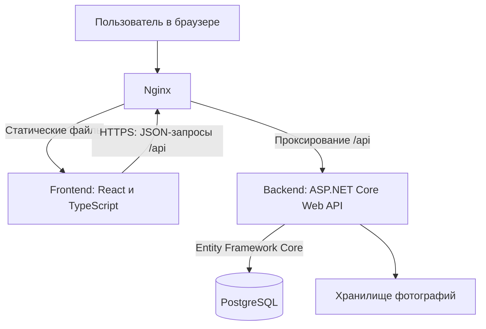
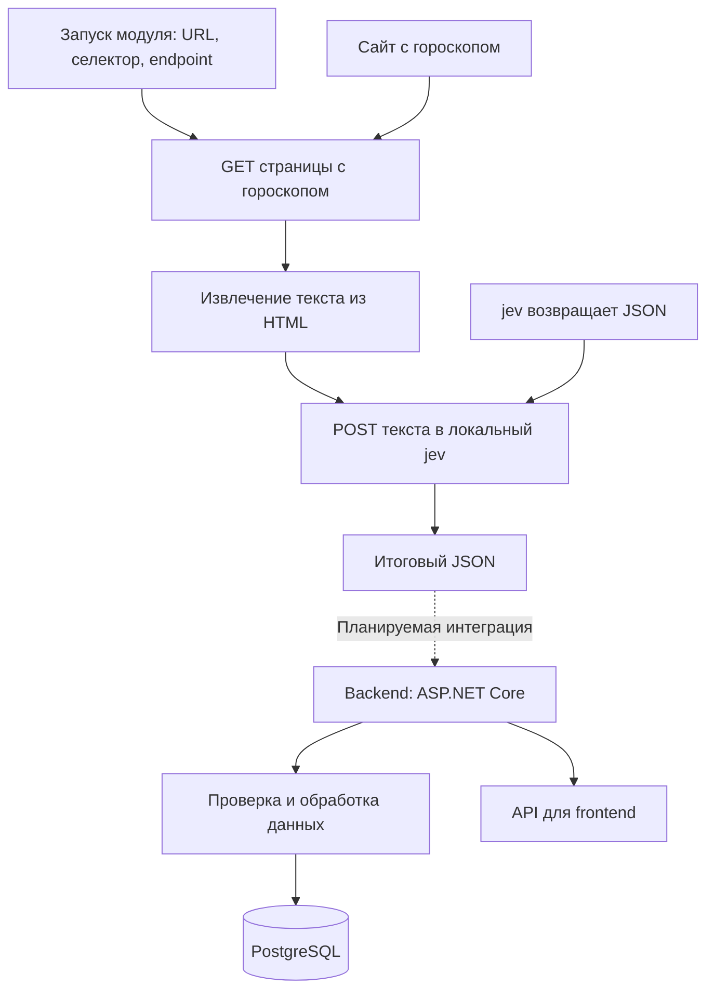
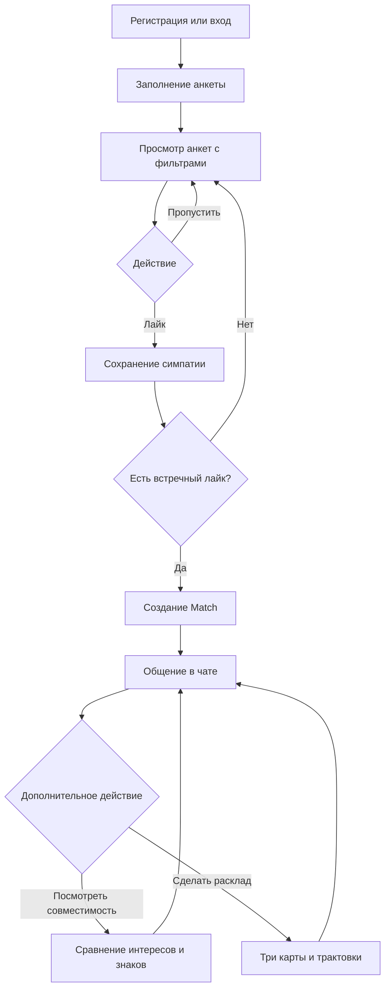

# Сервис знакомств с функицей расскладов таро.

Учебный командный проект: веб-приложение для поиска знакомств, взаимных симпатий и общения. Дополнительные функции — сравнение интересов, развлекательная совместимость по знакам зодиака и расклад Таро на отношения.

Название рабочее. Проценты зодиакальной совместимости и трактовки карт не являются научной оценкой отношений или прогнозом.

## Архитектура

Предварительно выбранный серверный стек: ASP.NET Core Web API, Entity Framework Core и PostgreSQL. Перед реализацией команда должна подтвердить его и API-контракты. Nginx и Docker Compose планируются для развёртывания.



Nginx отдаёт собранный frontend и передаёт API-запросы backend. Frontend отвечает за экраны, навигацию и ввод пользователя. Backend проверяет доступ, обрабатывает бизнес-правила и сохраняет данные. PostgreSQL хранит пользователей, анкеты, лайки, взаимные симпатии, сообщения и расклады. Фотографии хранятся отдельно; БД содержит ссылки на них.

Для локальной разработки frontend запускается через Vite. Текущий прототип использует моковые данные вместо запросов к backend. Docker Compose в целевом развёртывании объединит Nginx, backend и PostgreSQL; конкретное хранилище фотографий ещё предстоит выбрать.

## Модуль обработки гороскопа и его интеграция с backend

Отдельный модуль получает HTML страницы с гороскопом, извлекает текст по заданному CSS-селектору и отправляет его в локальный сервис jev. Результат выводится в формате JSON. Backend на ASP.NET Core будет принимать и обрабатывать этот результат; способ связи между ними команда определит при интеграции.



## Основной бизнес-процесс

Цель пользователя — найти интересного человека и начать общение после взаимной симпатии. Совместимость и Таро дополняют этот сценарий.



### Правила целевой системы

- Для просмотра анкет пользователь должен войти и заполнить обязательные поля профиля.
- Фильтры определяют, какие анкеты включаются в выдачу.
- Односторонний лайк не создаёт Match. Match возникает при двух встречных лайках.
- Повторный лайк не создаёт дубликаты симпатий или Match.
- Отправлять и читать сообщения могут только участники соответствующего Match.
- Совпадение интересов вычисляется по данным пары. Зодиакальная оценка отображается отдельно как развлекательная функция.
- Расклад выбирает три разные карты и показывает заранее подготовленные трактовки; AI не используется в базовом MVP.
- Premium и виртуальные монеты пока остаются макетами. Реальные платежи не входят в текущий этап.

Эти правила предстоит проверить при подключении backend. Поведение демонстрационного frontend может быть упрощено.

## Предварительная ERD

Схема показывает основные сущности и связи. Это проект БД; миграции ещё не реализованы. Типы идентификаторов и обязательность полей нужно закрепить при разработке.

```mermaiderDiagram
    users ||--o| user_profile : has
    users ||--o{ swipes : acts
    users ||--o{ swipes : receives
    users ||--o{ conversations : user_a
    users ||--o{ conversations : user_b
    conversations ||--o{ messages : contains
    users ||--o{ messages : sends
    conversations ||--o{ message_reads : tracks
    users ||--o{ message_reads : reads
    messages ||--o{ attachments : has
    messages |o--o{ messages : replies_to
    messages |o--o{ conversations : last_message

    users {
        uuid id PK
        text username UK
        text email UK
        text phone_number UK
    }

    user_profile {
        uuid profile_id PK
        uuid user_id FK
        text bio
        text properties
        varchar sex
        date birth_date
        timestamp last_seen_at
        timestamp created_at
    }

    swipes {
        uuid actor_id PK,FK
        uuid target_id PK,FK
        smallint action
        timestamp created_at
    }

    conversations {
        uuid id PK
        uuid user_a_id FK
        uuid user_b_id FK
        uuid last_message_id FK
        timestamp last_message_at
        text last_message_body
        timestamp created_at
        timestamp updated_at
    }

    messages {
        uuid id PK
        uuid conversation_id FK
        uuid sender_id FK
        bigint seq
        text body
        text type
        uuid reply_to_id FK
        timestamp created_at
        timestamp edited_at
    }

    message_reads {
        uuid conversation_id PK,FK
        uuid user_id PK,FK
        bigint last_read_seq
        timestamp last_read_at
    }

    attachments {
        uuid id PK
        uuid message_id FK
        text file_name
        text mime_type
        text base64_url
        timestamp created_at
    }
```

Дополнительные ограничения: нельзя лайкать себя; пара участников Match уникальна независимо от порядка; у каждого расклада ровно три позиции и разные карты. Эти ограничения задаются в БД и серверной логике. Знак зодиака и возраст вычисляются по дате рождения, а не сохраняются отдельными полями.

## Предварительные API-контракты

Это перечень планируемых операций, а не готовая спецификация. До интеграции необходимо согласовать JSON-поля запросов и ответов, ошибки, авторизацию и пагинацию, затем оформить OpenAPI.

| Метод и путь | Назначение |
|---|---|
| POST /api/auth/register | Регистрация |
| POST /api/auth/login | Вход |
| GET /api/me | Получение своего профиля |
| PATCH /api/me | Изменение своего профиля |
| POST /api/me/photos | Загрузка фотографии |
| GET /api/profiles | Получение анкет с фильтрами и пагинацией |
| GET /api/profiles/{userId} | Просмотр анкеты |
| POST /api/likes | Лайк; ответ сообщает о созданном Match |
| GET /api/matches | Список взаимных симпатий |
| GET /api/matches/{matchId}/messages | Сообщения с пагинацией |
| POST /api/matches/{matchId}/messages | Отправка сообщения |
| GET /api/matches/{matchId}/compatibility | Совместимость пары |
| POST /api/matches/{matchId}/tarot-readings | Создание расклада |

Для чата способ обновления сообщений — периодические запросы или постоянное соединение — ещё нужно выбрать. Текущий frontend не вызывает перечисленные API.

## Roadmap

| Этап | Что делаем | Критерий готовности |
|---|---|---|
| 1. Анализ требований | Определяем основные сценарии, роли пользователей и границы MVP | Команда согласовала список функций и бизнес-правила |
| 2. Проектирование интерфейса | Утверждаем структуру экранов, навигацию и макеты | Понятен путь пользователя от регистрации до общения |
| 3. Архитектура и данные | Уточняем схему компонентов и ERD базы данных | Согласованы сущности, связи и выбранный стек |
| 4. Контракты API | Описываем запросы, ответы, ошибки и правила доступа | Frontend и backend могут разрабатываться независимо |
| 5. Frontend-прототип | Дорабатываем существующие экраны с моковыми данными | Основные сценарии можно пройти без ошибок |
| 6. Регистрация и профили | Реализуем вход, создание и редактирование анкеты, загрузку фото | Данные пользователя сохраняются после повторного входа |
| 7. Лента и фильтры | Подключаем выдачу анкет и параметры поиска к API | Лента показывает подходящие анкеты из базы данных |
| 8. Лайки и Match | Реализуем симпатии и проверку взаимности | Два встречных лайка создают один Match |
| 9. Чаты | Подключаем список диалогов и отправку сообщений | Участники Match могут обмениваться сообщениями |
| 10. Совместимость и Таро | Реализуем сравнение интересов и развлекательный расклад | Результаты формируются для пары и корректно отображаются |
| 11. Интеграция и тестирование | Проверяем работу частей системы вместе и исправляем ошибки | Основные сценарии проходят на двух тестовых аккаунтах |
| 12. Развёртывание | Настраиваем Docker Compose, Nginx и инструкцию запуска | Приложение запускается по инструкции и доступно для демонстрации |

## Организация работы в GitHub

- Репозиторий проекта размещается в созданной организации.
- Ветка `main` содержит проверенную версию.
- Для задач создаются отдельные ветки.
- Изменения объединяются через Pull Request с описанием и результатом проверки.
- Задачи и критерии готовности фиксируются в Issues.
- Секреты и локальные зависимости исключаются через `.gitignore`.

## Локальный запуск

В процессе написания.
