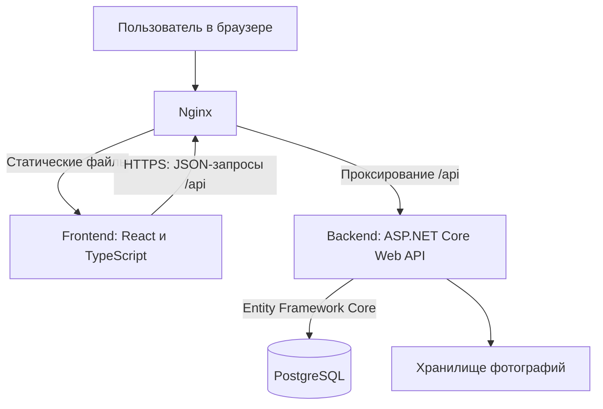
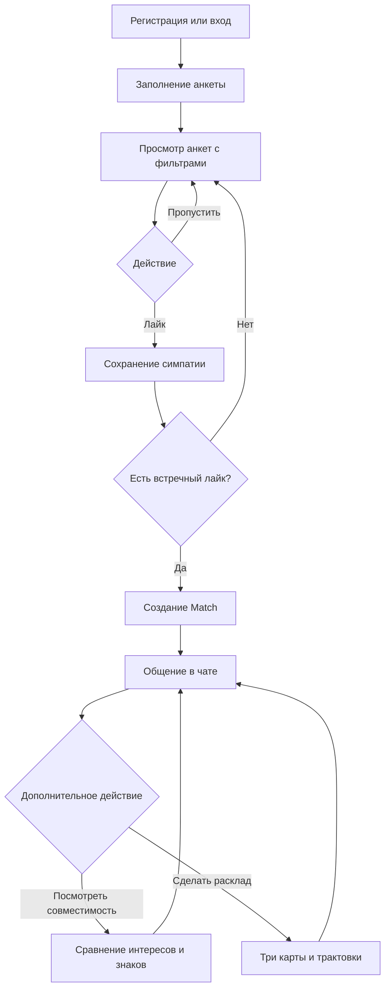
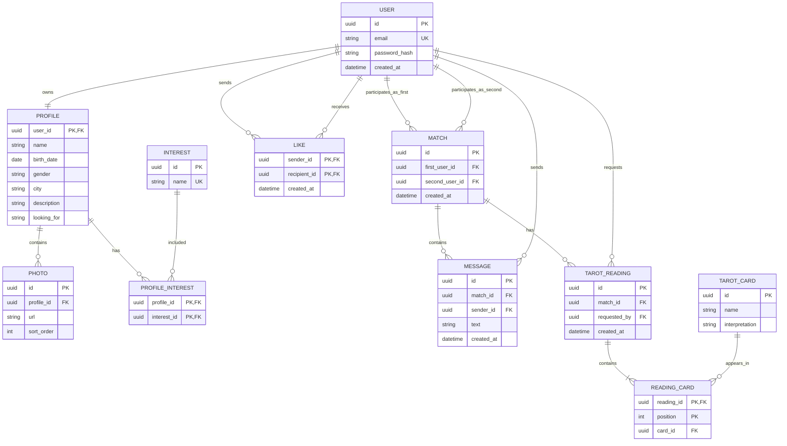

# Сервис знакомств с модулем совместимости

Учебный командный проект: веб-приложение для поиска знакомств, взаимных симпатий и общения. Дополнительные функции — сравнение интересов, развлекательная совместимость по знакам зодиака и расклад Таро на отношения.

Название рабочее. Проценты зодиакальной совместимости и трактовки карт не являются научной оценкой отношений или прогнозом.

## Текущее состояние

Реализован frontend-прототип на React, TypeScript и Vite. По текущему отчёту разработки доступны лента анкет, фильтры, взаимные симпатии, чаты, экран совместимости, расклад и профиль. Данные демонстрационные, действия выполняются локально.

Backend, PostgreSQL, серверная авторизация и реальные платежи пока не подключены. Схемы ниже описывают целевую систему, а не уже развёрнутую инфраструктуру.

## Архитектура

Предварительно выбранный серверный стек: ASP.NET Core Web API, Entity Framework Core и PostgreSQL. Перед реализацией команда должна подтвердить его и API-контракты. Nginx и Docker Compose планируются для развёртывания.



Nginx отдаёт собранный frontend и передаёт API-запросы backend. Frontend отвечает за экраны, навигацию и ввод пользователя. Backend проверяет доступ, обрабатывает бизнес-правила и сохраняет данные. PostgreSQL хранит пользователей, анкеты, лайки, взаимные симпатии, сообщения и расклады. Фотографии хранятся отдельно; БД содержит ссылки на них.

Для локальной разработки frontend запускается через Vite. Текущий прототип использует моковые данные вместо запросов к backend. Docker Compose в целевом развёртывании объединит Nginx, backend и PostgreSQL; конкретное хранилище фотографий ещё предстоит выбрать.

## Основной бизнес-процесс

Цель пользователя — найти интересного человека и начать общение после взаимной симпатии. Совместимость и Таро дополняют этот сценарий.



### Правила целевой системы

- Для просмотра анкет пользователь должен войти и заполнить обязательные поля профиля.
- Фильтры определяют, какие анкеты включаются в выдачу.
- Односторонний лайк не создаёт Match. Match возникает при двух встречных лайках.
- Повторный лайк не создаёт дубликаты симпатий или Match.
- Отправлять и читать сообщения могут только участники соответствующего Match.
- Совпадение интересов вычисляется по данным пары. Зодиакальная оценка отображается отдельно как развлекательная функция.
- Расклад выбирает три разные карты и показывает заранее подготовленные трактовки; AI не используется в базовом MVP.
- Premium и виртуальные монеты пока остаются макетами. Реальные платежи не входят в текущий этап.

Эти правила предстоит проверить при подключении backend. Поведение демонстрационного frontend может быть упрощено.

## Предварительная ERD

Схема показывает основные сущности и связи. Это проект БД; миграции ещё не реализованы. Типы идентификаторов и обязательность полей нужно закрепить при разработке.



Дополнительные ограничения: нельзя лайкать себя; пара участников Match уникальна независимо от порядка; у каждого расклада ровно три позиции и разные карты. Эти ограничения задаются в БД и серверной логике. Знак зодиака и возраст вычисляются по дате рождения, а не сохраняются отдельными полями.

## Предварительные API-контракты

Это перечень планируемых операций, а не готовая спецификация. До интеграции необходимо согласовать JSON-поля запросов и ответов, ошибки, авторизацию и пагинацию, затем оформить OpenAPI.

| Метод и путь | Назначение |
|---|---|
| POST /api/auth/register | Регистрация |
| POST /api/auth/login | Вход |
| GET /api/me | Получение своего профиля |
| PATCH /api/me | Изменение своего профиля |
| POST /api/me/photos | Загрузка фотографии |
| GET /api/profiles | Получение анкет с фильтрами и пагинацией |
| GET /api/profiles/{userId} | Просмотр анкеты |
| POST /api/likes | Лайк; ответ сообщает о созданном Match |
| GET /api/matches | Список взаимных симпатий |
| GET /api/matches/{matchId}/messages | Сообщения с пагинацией |
| POST /api/matches/{matchId}/messages | Отправка сообщения |
| GET /api/matches/{matchId}/compatibility | Совместимость пары |
| POST /api/matches/{matchId}/tarot-readings | Создание расклада |

Для чата способ обновления сообщений — периодические запросы или постоянное соединение — ещё нужно выбрать. Текущий frontend не вызывает перечисленные API.

## Roadmap

| Этап | Результат | Критерий готовности |
|---|---|---|
| 1. Frontend-прототип | Экраны и моковые сценарии | Проект собирается, основные переходы можно проверить вручную |
| 2. Проектирование | ERD, бизнес-правила, API-контракты | Команда согласовала сущности, JSON-схемы и ошибки |
| 3. Backend и БД | Авторизация, профили, лайки, Match | Данные сохраняются; взаимный лайк создаёт ровно один Match |
| 4. Интеграция | Frontend работает с API | Два аккаунта могут заполнить профили, создать Match и обменяться сообщениями |
| 5. Дополнительные функции | Совместимость и расклады | Результаты доступны участникам пары, расклады сохраняются |
| 6. Развёртывание и проверка | Работающая демонстрация | Приложение разворачивается по инструкции, основные сценарии проверены |

Календарные сроки и ответственные добавляются командой после согласования учебного графика. Таблица этапов не заменяет календарный план.

## Организация работы в GitHub

- Репозиторий проекта размещается в созданной организации.
- Ветка `main` содержит проверенную версию.
- Для задач создаются отдельные ветки, например `feature/profile-edit`.
- Изменения объединяются через Pull Request с описанием и результатом проверки.
- Задачи и критерии готовности фиксируются в Issues.
- Секреты и локальные зависимости исключаются через `.gitignore`.

## Локальный запуск frontend

Нужны Git и Node.js, совместимый с версией Vite в `package.json`. Точная ссылка клонирования берётся со страницы репозитория организации.

После клонирования откройте корень frontend-проекта:

```bash
npm ci
npm run dev
```

В PowerShell при ограничении запуска `npm.ps1` используйте `npm.cmd ci` и `npm.cmd run dev`. Адрес приложения выводится в терминале; если порт занят, Vite может выбрать следующий.

Проверка production-сборки:

```bash
npm run build
```

## Что остаётся согласовать

Окончательное название, обязательные поля анкеты, серверный стек, правила фильтрации, формулу совпадения интересов, API-контракты, хранение фотографий, календарный план и ответственных.

